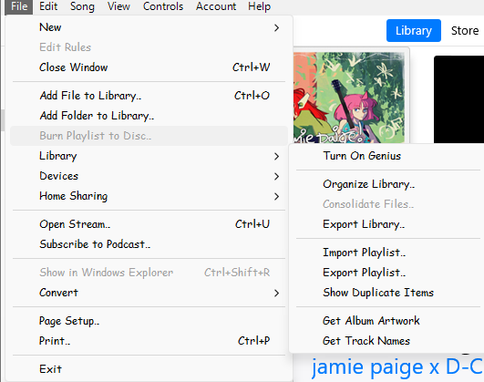

# iTunesLibraryCopier
Copies selected items from an iTunes Library XML file and lets you move those specific files to whatever you want

# Getting Started
<b>This program is intended for use on iTunes for Windows. It has not been tested with the new Apple Music apps on the Microsoft Store, or on iTunes for macOS or the Apple Music replacement in moderm macOS.</b>

## Creating necessary files
To start, you will need to export your library as a .xml through iTunes. In iTunes, click File -> Library -> Export Library

Be sure to put this xml file in a place that you will know where it is at.

# Broken things
Any song using the "Open Stream" will currently throw an error. Try to avoid having any songs in your library like that.